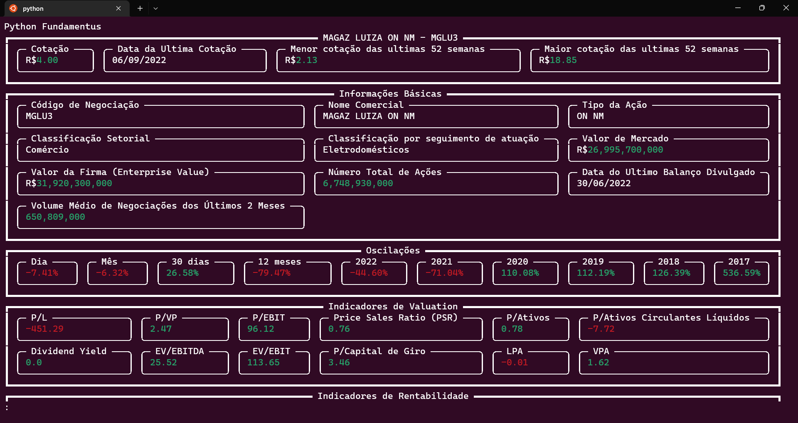
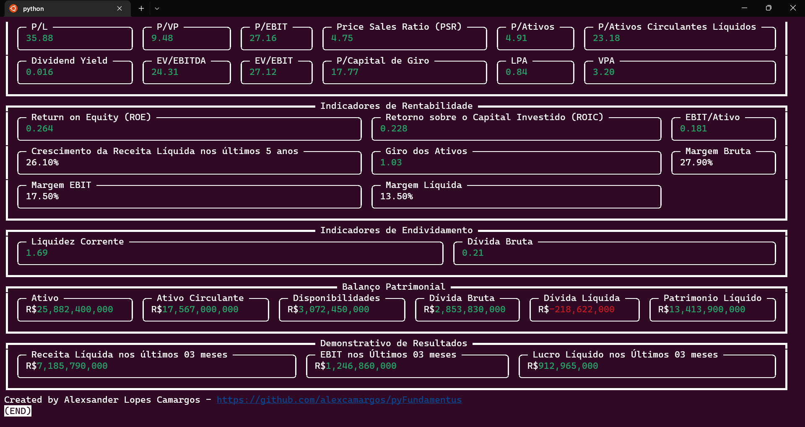

# Python Fundamentus

[](LICENSE)
[](https://codecov.io/github/alexcamargos/pyFundamentus)

> `Python Fundamentus` is a Python API that allows you to quickly access the main fundamental indicators of the main stocks in the Brazilian market.

O Python Fundamentus é uma API desenvolvida em Python projetada para facilitar o acesso rápido aos principais indicadores fundamentais das ações mais relevantes do mercado brasileiro. Utilizando as informações disponíveis no site [Fundamentus](https://www.fundamentus.com.br/) diponibiliza informações financeiras e fundamentalistas detalhadas das empresas listadas na [B3](https://www.b3.com.br/), este projeto busca trazer a riqueza de dados financeiros diretamente para suas aplicações Python de maneira eficiente e organizada.

## Sobre o Fundamentus

O [Fundamentus](https://www.fundamentus.com.br/) se destaca como uma plataforma essencial para investidores que buscam dados aprofundados e insights financeiros das empresas negociadas na Bolsa de Valores brasileira. Com um banco de dados abrangente e facilmente acessível, o Fundamentus oferece uma análise detalhada do estado econômico-financeiro das empresas, além de uma avaliação cuidadosa do nível de preço de mercado, apoiando assim a tomada de decisão informada para investimentos.

## Recursos da API Python Fundamentus

Acesso Simplificado aos Dados: Com apenas algumas linhas de código, obtenha informações financeiras essenciais, incluindo lucro líquido, receita líquida, EBITDA, dívida líquida, entre outros.
Análise Fundamentalista ao seu Alcance: Explore os principais indicadores fundamentalistas, como P/L, ROE, ROIC, DY, e muitos outros, para avaliar a saúde financeira e o potencial de investimento das empresas.
Atualizações Constantes: Dados sempre atualizados, refletindo as últimas informações disponíveis no mercado.

## Por Que Usar o Python Fundamentus?

Este projeto é ideal para desenvolvedores, analistas financeiros, investidores individuais e institucionais que desejam incorporar análises fundamentalistas em suas estratégias de investimento ou ferramentas financeiras. Com a Python Fundamentus, você pode:
- Automatizar a coleta e análise de dados financeiros.
- Integrar análises fundamentalistas em aplicações de investimento personalizadas.
- Realizar pesquisas financeiras detalhadas com eficiência e precisão.

## Como Começar
Para começar a usar o Python Fundamentus, siga os passos abaixo:

### Instalação

`pip install pyfundamentus`

#### Usando a API

```python

import fundamentus

URL = 'https://www.fundamentus.com.br/detalhes.php'
PAYLOAD = {'papel': 'VALE3', 'interface': 'mobile'}

main_pipeline = fundamentus.Pipeline(url=URL, params=PAYLOAD)
response = main_pipeline.get_all_information()

# Extract the information from the response.
price_information = response.transformed_information['price_information']
detailed_information = response.transformed_information['detailed_information']
oscillations = response.transformed_information['oscillations']
valuation_indicators = response.transformed_information['valuation_indicators']
profitability_indicators = response.transformed_information['profitability_indicators']
indebtedness_indicators = response.transformed_information['indebtedness_indicators']
balance_sheet = response.transformed_information['balance_sheet']
income_statement = response.transformed_information['income_statement']
```

### Exibindo Informações Diretamente

```bash
git clone git@github.com:alexcamargos/pyFundamentus.git

python run_rich.py VALE3
```

## Exemplos

`python run_rich.py mglu3`



`python run_rich.py wege3`



## Contribua

Contribuições são sempre bem-vindas! Se você tem ideias para melhorar a API ou adicionar novas funcionalidades, sinta-se à vontade para criar um fork do projeto e enviar um pull request. Juntos, podemos tornar a Python Fundamentus uma ferramenta ainda mais poderosa para a comunidade de investidores.

## Autor

Feito com :heart: por [Alexsander Lopes Camargos](https://github.com/alexcamargos) :wave: Entre em contato!

[](https://github.com/alexcamargos)
[](https://twitter.com/alcamargos)
[](https://www.linkedin.com/in/alexcamargos/)
[](mailto:alcamargos@vivaldi.net)

## Copyright

Copyright 2022-2024 by Alexsander Lopes Camargos.

## Licença

Este projeto é distribuído sob a licença MIT. Veja o arquivo [MIT License](LICENSE) para mais detalhes.
